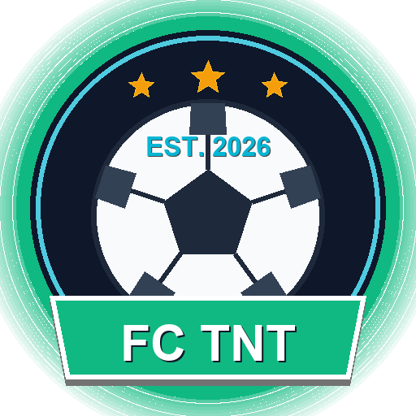

# ⚽ FC TNT - Nền Tảng Quản Trị Đội Bóng Phong Trào Toàn Diện

<p align="center">
  
</p>

<p align="center">
  <strong>"Đá hết mình – Thắng cùng mừng, Thua cùng uống"</strong>
</p>

<p align="center">
  <a href="https://fc-tnt.onrender.com/"></a>
  
  
  
  
  
</p>

---

## 📖 Giới Thiệu (Overview)

**FC TNT** là ứng dụng web quản lý bóng đá phong trào (phủi) hiện đại, chuyên nghiệp, tối ưu cho sân bóng 7 người. Ứng dụng giải quyết toàn bộ các bài toán thường nhật của một đội bóng phong trào: từ xếp đội hình chiến thuật, chấm điểm phong độ bằng AI, đồng bộ diễn biến trận đấu trực tiếp liên thiết bị, chia tiền sân nhanh với VietQR, đến dự báo thời tiết sân đấu và lưu giữ kỷ niệm anh em.

Ứng dụng hoạt động theo kiến trúc **Single-Page Application (SPA)** nhẹ, mượt mà trên cả trình duyệt máy tính lẫn điện thoại di động (hỗ trợ PWA).

---

## ✨ Tính Năng Nổi Bật (Key Features)

### 1. 📋 Sơ Đồ Chiến Thuật Sân 7 Chuẩn Phong Cách Sofascore (3-1-2)
- Trực quan hóa sân bóng cỏ nhân tạo với đầy đủ các vị trí: Thủ môn (GK), Trung vệ thòng (CB), 2 Hậu vệ cánh dập (LB/RB), Tiền vệ trung tâm cầm nhịp (CM) và 2 Tiền đạo cánh (LF/RF).
- Đổi vị trí linh hoạt, chọn cầu thủ đá chính / dự bị chỉ bằng 1 chạm.
- Tự động hiển thị huy hiệu thẻ phạt, bàn thắng, kiến tạo và điểm rating trực tiếp trên sơ đồ.

### 2. 🤖 Chấm Điểm Trận Đấu Bằng Trí Tuệ Nhân Tạo (AI Match Rating)
- Tích hợp **Google Gemini AI Flash & Smart NLP Rule Engine** am hiểu văn hóa bóng đá phủi Việt Nam.
- Tự động nhận diện biệt danh phủi (vd: *Quân Kun, Vinh Lê, ToDiu, Quang Voi, Hùng Sứt, Tài Thọ...*).
- Chấm điểm khắt khe, công tâm theo thang điểm 10 chuẩn Sofascore (4.0 -> 9.9), phát hiện siêu phẩm, kiến tạo, bọc lót, pha cứu thua xuất thần, tình huống bỏ lỡ và cả các pha "tấu hài" sân cỏ.

### 3. 📡 Đồng Bộ Trận Đấu Trực Tiếp Đa Thiết Bị (Live Match Sync)
- Quản lý trận đấu đang diễn ra theo thời gian thực (đồng hồ trận đấu, hiệp 1 / hiệp 2, tỉ số, sự kiện thẻ/bàn thắng/thay người).
- Công nghệ **Socket.IO Real-time Sync**: Đội trưởng bấm sự kiện trên sân, mọi thành viên khác mở web đều cập nhật tức thì mà không cần tải lại trang.

### 4. 🌦️ Radar Thời Tiết 7 Ngày & AI Thẩm Định Sân AKKA
- Dự báo thời tiết tại **Sân bóng đá AKKA (68 Đại Lộ Chu Văn An, Hà Nội)** từ Open-Meteo API.
- Tự động lọc 2 khung giờ thi đấu vàng: **Slot 1 (20h45 - 22h15)** và **Slot 2 (22h15 - 23h45)**.
- Chỉ số khả năng thi đấu (MPI 0 - 100%), radar mưa theo giờ và AI tính toán thời gian róc nước của nền đá mi sân AKKA để tư vấn trang phục và loại giày đinh TF chống trơn trượt.

### 5. 💰 Sổ Quỹ & Chia Tiền Sân Tự Động (VietQR Payment)
- Nhập tổng tiền sân và nước uống -> Hệ thống tự động chia đều cho các thành viên tham gia thi đấu.
- Tạo mã **VietQR** chuyển khoản tức thì kèm cú pháp nộp tiền chuẩn xác.
- Theo dõi trạng thái đã đóng / chưa đóng tiền của từng người.

### 6. 🏆 Bảng Vinh Danh & Thống Kê Phong Độ (Hall of Fame)
- Tự động thống kê và xếp hạng: **Top Ghi Bàn (Vua Phá Lưới)**, **Vua Kiến Tạo**, **Cầu Thủ Xuất Sắc Nhất Trận (MOTM)** và **Găng Tay Vàng**.

### 7. 📸 Bảng Tin Khoảnh Khắc (FC TNT Moments)
- Đăng album ảnh kỷ niệm (liên hoan, ra mắt áo đấu, tiệc sinh nhật).
- Thả cảm xúc phong cách phủi: Bia, Tim, Bóng, Lửa (🍻, ❤️, ⚽, 🔥).
- Khung bình luận "chém gió" vui vẻ giữa các thành viên.

### 8. 🎨 Xuất Poster Trận Đấu 1-Chạm (Shareable Match Cards)
- Tạo ảnh poster đồ họa chất lượng cao kết quả trận đấu kèm logo, tỉ số và danh hiệu MOTM.
- 4 phong cách thiết kế: Cyber Neon, Gold Champion, Emerald Pitch, Crimson Fire sẵn sàng để chia sẻ lên Facebook, Zalo, Story.

---

## 🏗️ Cấu Trúc Dự Án (Project Structure)

Dự án được tổ chức theo mô hình phân tách trách nhiệm rõ ràng:

```
FC-TNT/
├── assets/
│   ├── icons/            # Bộ icon favicon, apple-touch-icon, PWA icons
│   └── images/           # Logo CLB, logo.svg, hình ảnh nền
├── css/                  # [Mô-đun hoá] Giao diện phân tầng (base, matches, live, moments, finance, weather, effects, responsive)
│   └── style.css         # Master Stylesheet Hub tích hợp toàn bộ module
├── js/                   # Modules logic phía Client (Single-Page App)
│   ├── app.js            # Điều hướng tab, modal, toast
│   ├── state.js          # Quản lý state tập trung (APP_STATE) & Socket.IO
│   ├── matches.js        # Bộ điều phối trung tâm (Facade) module trận đấu
│   ├── matches/          # [Mô-đun hoá] Submodules: list, pitch sân 7, AI rating, live match
│   ├── players.js        # Quản lý danh sách cầu thủ & form thêm/sửa
│   ├── finance.js        # Công thức chia tiền sân & VietQR
│   ├── awards.js         # Bảng xếp hạng vinh danh cá nhân
│   ├── poster.js         # Canvas xuất ảnh poster chia sẻ mạng xã hội
│   ├── moments.js        # Feed khoảnh khắc & tương tác cộng đồng
│   ├── weather.js        # Radar thời tiết & AI cố vấn chiến thuật
│   ├── splash.js         # Màn hình khởi động & game tâng bóng
│   └── effects.js        # Âm thanh & pháo hoa confetti
├── models/               # Mongoose Schemas (MongoDB)
│   ├── Player.js         # Cầu thủ & tài khoản ngân hàng
│   ├── Match.js          # Chi tiết trận đấu & đội hình
│   ├── LiveMatchDraft.js # Bản nháp trận đấu Live
│   ├── Moment.js         # Bài đăng khoảnh khắc
│   └── Team.js           # Cấu hình đội bóng & Admin PIN
├── routes/               # API Router Backend mô-đun hoá
│   ├── auth.js           # API xác thực PIN & middleware requireAdmin
│   ├── players.js        # API CRUD cầu thủ & avatar
│   ├── matches.js        # API trận đấu & quản lý thu chi quỹ trận
│   ├── ai.js             # API AI rate match chấm điểm trận đấu & NLP Gemini
│   ├── liveMatch.js      # API live match sync bản nháp thời gian thực
│   ├── moments.js        # API khoảnh khắc, cảm xúc & bình luận
│   └── weather.js        # API thời tiết Open-Meteo & AI cố vấn mặt sân
├── scripts/              # Công cụ tiện ích
│   └── generate_favicons.py # Script Python tự động sinh bộ favicon & logo
├── .env                  # Biến môi trường
├── index.html            # Khung giao diện chính SPA
├── manifest.json         # Cấu hình PWA
├── package.json          # Dependencies & npm scripts
├── server.js             # App Bootstrap tinh gọn (~220 dòng)
├── ARCHITECTURE.md       # Tài liệu chi tiết kiến trúc kỹ thuật
└── FEATURE_ROADMAP.md    # Lộ trình nâng cấp tính năng tương lai
```

> Chi tiết kỹ thuật vui lòng tham khảo [ARCHITECTURE.md](file:///ARCHITECTURE.md).

---

## 🚀 Cài Đặt & Chạy Dưới Local (Getting Started)

### 1. Yêu cầu môi trường
- **Node.js**: Phiên bản 18 trở lên
- **MongoDB**: Đã cài cục bộ hoặc có tài khoản MongoDB Atlas (Cloud)

### 2. Clone mã nguồn & Cài đặt thư viện
```bash
# Clone repository
git clone https://github.com/nguyencongquana2/fc-tnt.git
cd fc-tnt

# Cài đặt các gói phụ thuộc
npm install
```

### 3. Cấu hình biến môi trường (`.env`)
Tạo file `.env` tại thư mục gốc của dự án:
```bash
cp .env.example .env
```
Nội dung file `.env`:
```env
# Cổng chạy ứng dụng
PORT=3000

# Chuỗi kết nối MongoDB (Local hoặc MongoDB Atlas)
MONGODB_URI=mongodb://localhost:27017/fc_tnt

# Mã PIN Quản trị viên (Dùng để thêm/sửa/xoá trận đấu và cầu thủ)
ADMIN_PIN=123456

# Google Gemini API Key (Dùng cho AI chấm điểm trận đấu & cố vấn thời tiết)
GEMINI_API_KEY=your_gemini_api_key_here
```

### 4. Khởi động ứng dụng
```bash
# Chế độ phát triển (Tự động tải lại khi sửa code)
npm run dev

# Hoặc khởi động bình thường
npm start
```
Mở trình duyệt và truy cập: **`http://localhost:3000`**

---

## 🔐 Xác Thực & Quản Trị (Admin Access)

- **Mã PIN mặc định**: `123456` (hoặc cấu hình qua biến `ADMIN_PIN` trong `.env`).
- Để thao tác Thêm/Sửa/Xóa cầu thủ, tạo trận đấu mới, hoặc khôi phục dữ liệu, nhấn vào nút **"Đăng nhập Quản trị viên"** ở thanh điều hướng và nhập mã PIN.
- Sau khi đăng nhập, hệ thống sẽ lưu token an toàn trong phiên làm việc.

---

## 🌐 Triển Khai (Deployment)

Dự án được cấu hình sẵn để triển khai dễ dàng lên các nền tảng đám mây:

### Triển khai trên Render.com
1. Tạo một **Web Service** mới trên [Render.com](https://render.com/).
2. Kết nối với GitHub Repository của dự án.
3. Cấu hình thông tin:
   - **Environment**: `Node`
   - **Build Command**: `npm install`
   - **Start Command**: `node server.js`
4. Khai báo các **Environment Variables**:
   - `MONGODB_URI`: Chuỗi kết nối tới MongoDB Atlas.
   - `ADMIN_PIN`: Mã PIN bảo mật cho Admin.
   - `GEMINI_API_KEY`: API Key từ Google AI Studio.

---

## 🗺️ Lộ Trình Phát Triển (Roadmap)

Xem kế hoạch phát triển các tính năng tiếp theo (Tích hợp Bot thông báo Zalo, Sổ quỹ nâng cao, Điểm danh trận đấu...) tại tài liệu:
👉 **[FEATURE_ROADMAP.md](file:///FEATURE_ROADMAP.md)**

---

## 📄 Bản Quyền (License)

Dự án được phát triển và sở hữu bởi **FC TNT Club**.  
Mọi đóng góp và ý tưởng xin vui lòng liên hệ Ban cán sự đội bóng.
